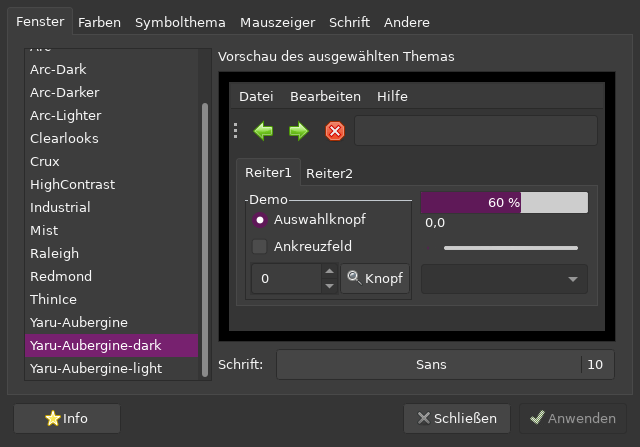

--- 
title: "Here we go again"
layout: page
--- 

## Yet another functional setup without bells and whistles.

### IDE/Editor

My "IDE" is a simple text-editor called neovim but due to a few plugins it has all I need. Yet I don't want to call it an IDE as it starts within half a second and runs from the terminal. My neovim has support for all kinds of LSPs, snippets, Git, code formatting, and whatever I really need. Tons of stuff.

### Tools

- Neovim - hyperextensible Vim-based text editor
https://neovim.io/

As it says already it's a hyperextensible Vim-based text editor. I use it in a terminal and therefore it's pretty fast. Neovim has initialised a project already while VSCode starts. The absolute benefit for me is that I just need to download my configuration file(s) to a new setup, start neovim once or twice and everything is ready to go. No hassle. But the learning curve is ... weird.

- Tmux - tmux is a terminal multiplexer
https://github.com/tmux/tmux/wiki

Allows me to use just one terminal window to do 90% all the things I need to do through the day, while developing something with ProcessWire or frontend-related things.

- PrePros - Your Friendly Web Development Companion
https://prepros.io/

In case I need a tool that does all the SCSS, Sass, less, JS things I prefer the easy way here. A benefit is that I can save the config file for each project right in the project, put it into Git and whenever needed I reinstall Prepros and go from there. Another hassle-free tool.

- ScreamingFrog - The industry leading website crawler for Windows, macOS and Ubuntu.
https://www.screamingfrog.co.uk/seo-spider/

The easiest way to find issues on a website and while looking for errors it's stress-testing the hosting environment. In case you do SEO for a project you should give it a try. It's probably ProcessWire under the installable SEO-Tools.

Missing NPM, Composer, yarn, npx and things like that? 
I'm too old for that. 

Hosting/Server
webgo - german hosting company.
https://www.webgo.de/

Hosting Company of the Year in Germany since 2017 and probably the only hosting company I recommened to clients and even friends.

But almost any other hosting company that has git and Let's encrypt support. I curate a list for myself to know where to go but webgo would be probably my choice.

PW Modules
FormBuilder
ProCache
ProFields (RepeaterMatrix, AutoLinks, VerifiedUrl)
ProMailer

Duplicator
HannaCode
ImportPagesCSV
Jumplinks
MenuBuilder
PagefieldPairs
PageHitCounter
PricacyWire
ProcessChangelog
ProcessDatabaseBackups
ProcessWireUpgrade
RockHitCounter (PageHitCounter Addon by @bernhard)
Snippets
WireMailSmtp

I guess these are most of the time self-explanatory. There are a lot more modules I used, used to use and maybe will use some day. But all of these are in my default tool-belt when needed.

Workflow
I run Debian Linux on my main-machine where I do all my work and therefore have a local Apache2/MariaDB/PHP server setup running. Here starts absolute every project in its very own VirtualHost and Git repository.

I prefer to use a similar setup like @horst and do the actual development on my local machine and then deliver it to a testing/stage/qa system where clients can take a look at the progress. The difference here is that my dev/testing/stage setups all run on my hosting accounts. I like to have a bit more control at this point.

Everything gets transferred via Git. From local to testing/stage/qa and later on even the live environment. Changes will be made only on and within the local dev setup. So it's super easy to see whenever a client changes files or something was changed on the remote server.

I guess that's all.

Lorem ipsum dolor sit amet, consetetur sadipscing elitr, sed diam nonumy eirmod tempor invidunt ut labore et dolore magna aliquyam erat, sed diam voluptua. At vero eos et accusam et justo duo dolores et ea rebum. Stet clita kasd gubergren, no sea takimata sanctus est Lorem ipsum dolor sit amet.

1. first item
2. second item
3. probably the third one

Lorem ipsum dolor sit amet, consectetur adipisicing elit, sed do eiusmod tempor incididunt ut labore et dolore magna aliqua. Ut enim ad minim veniam, quis nostrud exercitation ullamco laboris nisi ut aliquip ex ea commodo consequat. Duis aute irure dolor in reprehenderit in voluptate velit esse cillum dolore eu fugiat nulla pariatur. Excepteur sint occaecat cupidatat non proident, sunt in culpa qui officia deserunt mollit anim id est laborum.

* list item on place one
* the second one Here
* another one that follows
